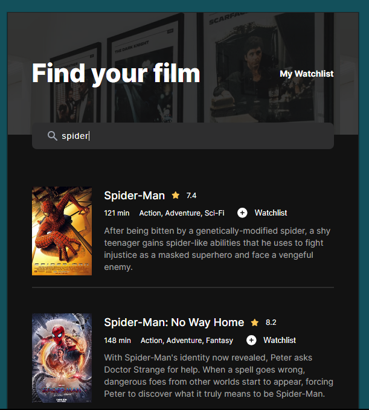
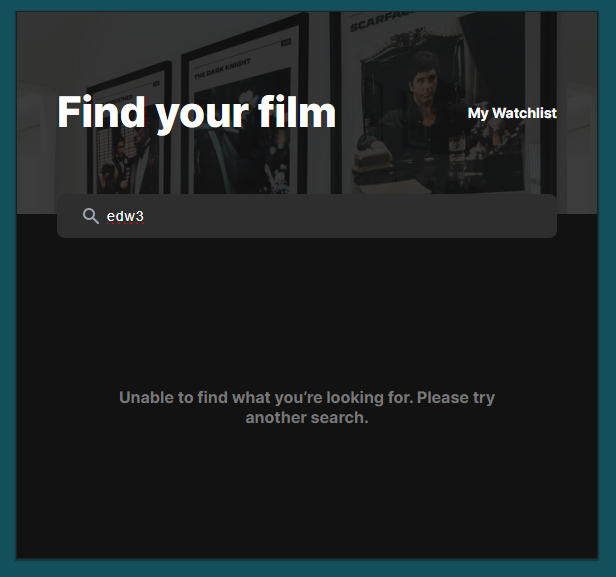

# Movie Search App

The Movie Search App is a simple web application that allows you to look up movies and save them to watchlist using data from the movie database API.




## Features

- **Movie Search:** Look up information on any movie by simply typing its title into the search bar.

- **Informative Results:** Get detailed information about the movie, including its title, release year, rating, plot, and poster.

- **Error Handling:** The app gracefully handles cases where a movie is not found, providing a clear message to the user.

## Technologies Used

- **JavaScript:** The core functionality of the app is implemented in JavaScript, making it interactive and responsive.

- **HTML:** The app's structure and content are built using HTML, ensuring compatibility with all modern web browsers.

- **Vanilla CSS:** The app is styled with vanilla CSS, giving it a clean and visually appealing design without the need for complex frameworks.

## Getting Started

To get started with the Movie Search App, follow these simple steps:

1. Clone this repository to your local machine.

   ```bash
   git clone https://github.com/yourusername/movie-search-app.git
